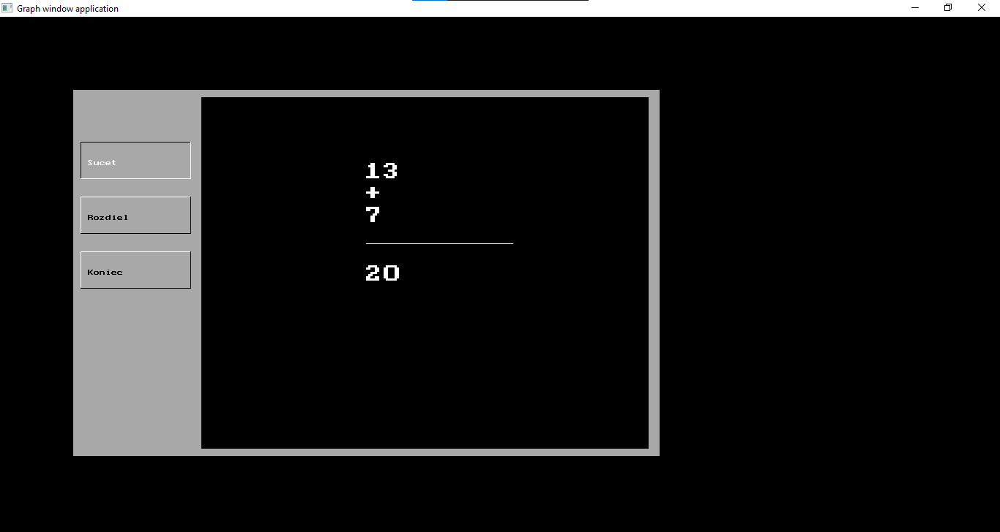

# Simple Lazarus Calculator

## Overview

This Lazarus program is a simple calculator that allows users to perform addition and subtraction operations. It serves as a beginner-friendly example of using Lazarus for GUI-based applications in Pascal.

## Features

- User-friendly interface with menu-based navigation.
- Supports addition and subtraction operations.
- Clean and straightforward code for educational purposes.

## Getting Started

### Prerequisites

Before running the program, ensure that you have the following installed:

- Lazarus IDE
- Free Pascal compiler

## Usage

1. Clone the repository: git clone https://github.com/msokolik55/lazarus-calculator.git
2. Open Lazarus IDE.
3. Open the project file (project1.lpi).
4. Compile and run the program.

## Program Structure
The program consists of the following key components:
- `pozadie`: Procedure for setting the background color.
- `tlacitka`: Procedure for drawing and handling menu buttons.
- `menu`: Procedure for navigating the main menu.
- `platno`: Procedure for clearing the drawing canvas.
- `zadajCislo`: Function for inputting numerical values.
- `priklad`: Procedure for displaying and calculating arithmetic examples.

## Screenshots

## License
This project is licensed under the MIT License - see the [LICENSE](LICENSE) file for details.
